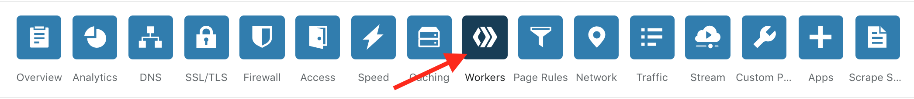
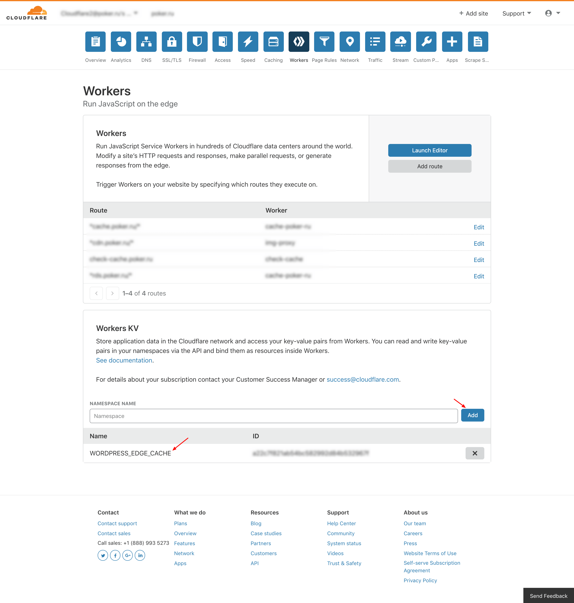
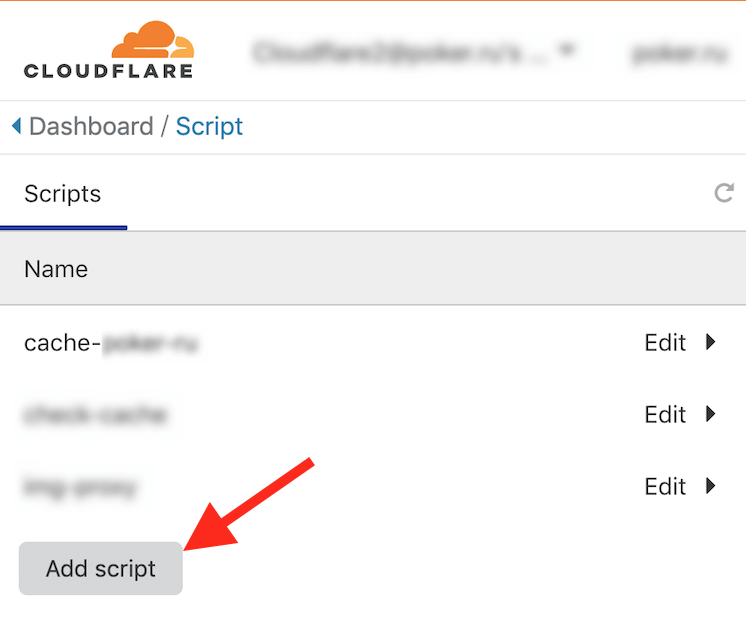
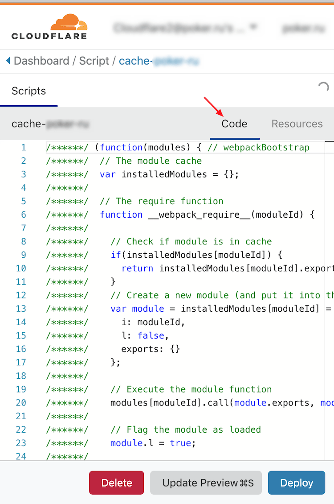
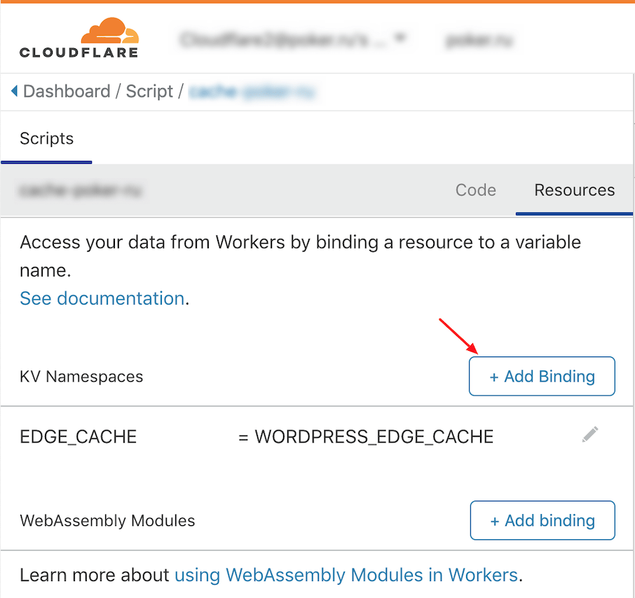
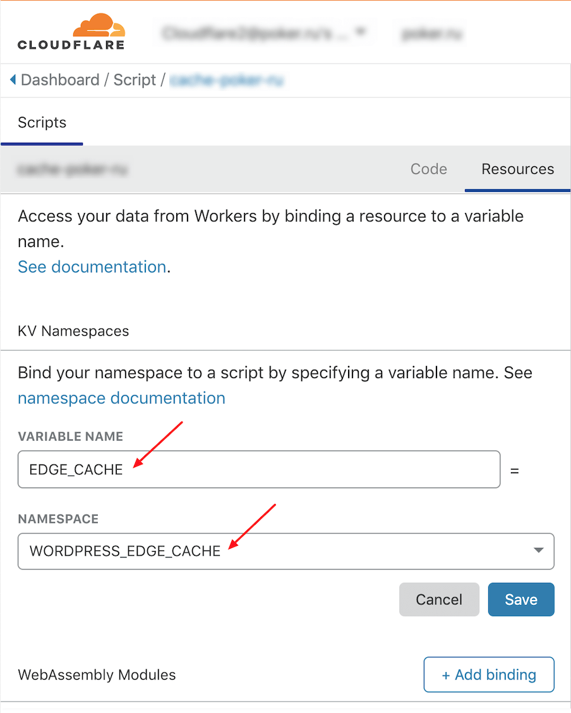
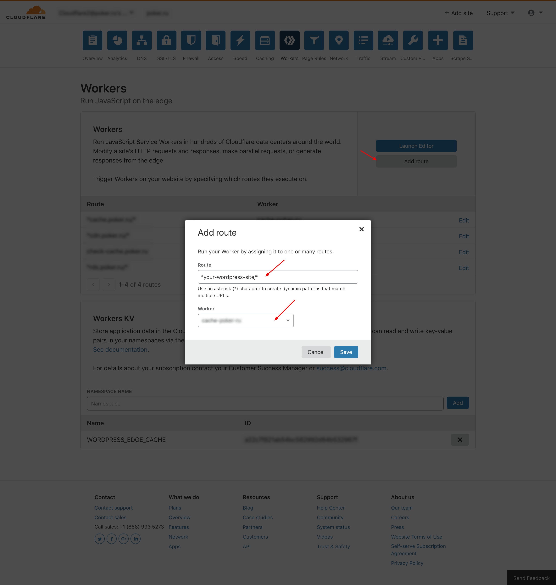

# Cache HTML Page on Cloudflare by Worker

The Service for caching HTML site pages on Cloudflare via Worker. Caching management is performed on the site side through the x-HTML-Edge-Cache header. The project [edge-cache-html]("https://github.com/cloudflare/worker-examples/tree/master/examples/edge-cache-html") was taken as the basis. The implementation was done in a typed programming language Typescript for the convenience of support and development.

## Installation

### Build script

Run

```sh
yarn build:worker
```

or

```sh
TS_NODE_PROJECT="tsconfig.json" webpack --config ./config/webpack.worker.ts
```

The script "worker.js" will be in the folder dist.

### Settings Worker on Cloudflare account

Go to Workers section.



Create new Worker KV (eg use namespace name "WORDPRESS_EDGE_CACHE").



Create new Worker Script (eg use name "cache-your_wordpress_site").



Go to Code section in the new script and add code from worker.js file.



Go to Resources section in the script and add binding: VARIABLE NAME - "EDGE_CACHE", NAMESPACE - "YOUR_CREATED_NAMESPACE" (eg "WORDPRESS_EDGE_CACHE").




Create new Route: Route - "\*your_wordpress_site/\*", Worker - "cache-your_wordpress_site".


## Using on sites

To cache HTML pages of your wordpress site, you need to install the wordpress plugin. For details see [a relative link](page-cache-on-cloudflare-wp-plugin/readme.txt).
