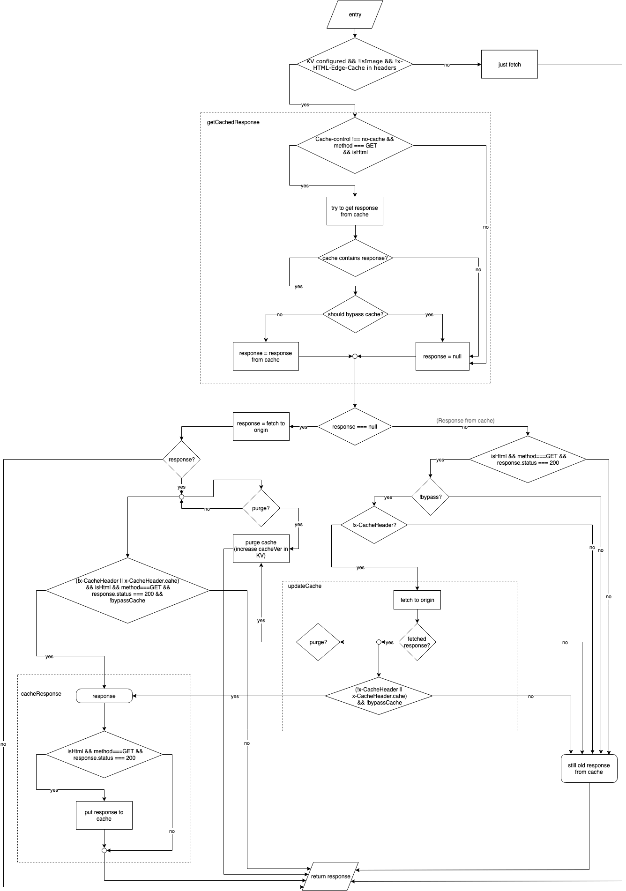

# Cache HTML Page on Cloudflare by Worker

The Service for caching HTML site pages on Cloudflare via Worker. Caching management is performed on the site side through the x-HTML-Edge-Cache header. The project https://github.com/cloudflare/worker-examples/tree/master/examples/edge-cache-html was taken as the basis. The implementation was done in a typed programming language Typescript for the convenience of support and development.

## How it works

The Cloudflare Worker processes the requests and caches according to the algorithm



## Installation

### Build script

Run

```sh
yarn build:worker
```

or

```sh
TS_NODE_PROJECT="tsconfig.json" webpack --config ./config/webpack.worker.ts
```

The script "worker.js" will be in the folder dist.

### Settings Worker on Cloudflare account

Go to Workers section and press "Manage KV namespaces".


Create a new Namespace in Worker KV (eg use namespace name "WORDPRESS_EDGE_CACHE") and press View to edit the new namespace.


Add 2 new entries (key-value) in KV namespace:
1/ key - html_cache_version, value - 0
2/ key - preload_cache, value - empty


Create new Worker Script (eg use name "cache-your_wordpress_site"). Go Workers section and press "Create a Worker". Add code from worker.js file to Script section and press "Save and Deploy".


Configure variables to Worker. Press "Edit variables" on new Worker review page.


Set variable name - "EDGE_CACHE", KV namespace - "YOUR_CREATED_NAMESPACE" (eg "WORDPRESS_EDGE_CACHE")


Create new Route: Route - "\*your_wordpress_site/\*", Worker - "cache-your_wordpress_site".


## Using on sites

To cache HTML pages of your wordpress site, you need to install the wordpress plugin. Please visit: https://wordpress.org/plugins/page-cache-on-cloudflare/. For details see [readme.txt](page-cache-on-cloudflare-wp-plugin/readme.txt).
